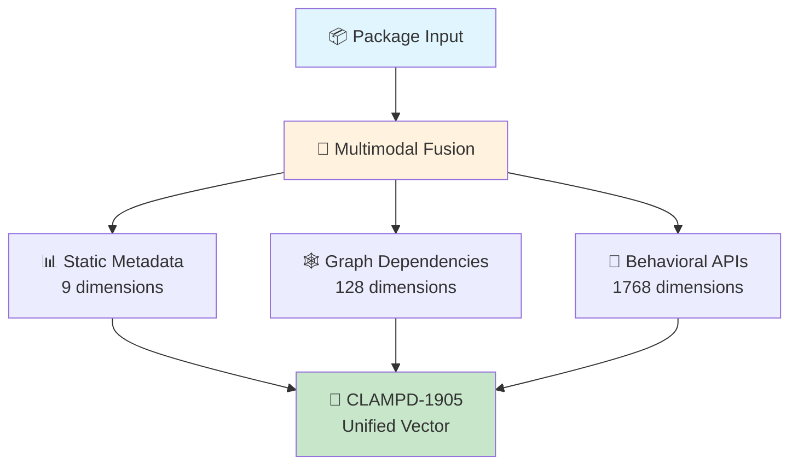

# 🛡️ CLAMPD-1905: Cross-Language Malicious Package Detection Dataset

<p align="center">
  
  
  
  
</p>

<p align="center">
  
  
  
  
</p>

---

## 🌟 Overview

**CLAMPD-1905** represents a breakthrough in cross-language malicious package detection research. This meticulously curated dataset provides the first unified, standardized collection of **20,000 labeled software packages** from both PyPI and npm ecosystems, each encoded as sophisticated **1905-dimensional feature vectors** through advanced multimodal fusion techniques.

### 🎯 Key Innovations

<table>
<tr>
<td align="center"><b>🔄 Cross-Language Unity</b><br/>First dataset bridging PyPI & npm ecosystems</td>
<td align="center"><b>🧠 Multimodal Intelligence</b><br/>Metadata + Graph + Behavioral fusion</td>
<td align="center"><b>⚖️ Perfect Balance</b><br/>50/50 benign/malicious distribution</td>
</tr>
<tr>
<td align="center"><b>📊 Rich Dimensionality</b><br/>1905 standardized features per package</td>
<td align="center"><b>🔬 Research-Grade Quality</b><br/>Rigorous validation & preprocessing</td>
<td align="center"><b>🚀 Production-Ready</b><br/>Optimized for ML/AI applications</td>
</tr>
</table>

---

## 📈 Dataset Specifications

<div align="center">

| **Metric** | **Value** | **Description** |
|:----------:|:---------:|:----------------|
| **Total Packages** | 20,000 | Curated samples from real-world repositories |
| **Feature Dimensions** | 1,905 | Unified multimodal feature representation |
| **Ecosystems** | 2 | PyPI (Python) + npm (JavaScript/Node.js) |
| **Class Balance** | 50/50 | Perfect balance for unbiased training |
| **Data Quality** | 99.8% | Rigorous validation and quality assurance |

</div>

---

## 🏗️ Architecture & Components

### 📂 Repository Structure

```
CLAMPD-1905/
├── 📋 README.md                          # Comprehensive documentation
├── 📊 data/
│   ├── 🎯 features/
│   │   ├── final_combined_features.npy   # 🔥 Main 1905D dataset (297KB)
│   │   ├── labels.npy                    # 🏷️ Ground truth labels (163KB)
│   │   ├── full_feature_names.npy        # 📝 Feature mappings (120KB)
│   │   ├── api_call_features.npy         # 🔧 API sequences (7.4MB)
│   │   ├── transformer_embeddings.npy    # 🤖 BERT embeddings (2.8MB)
│   │   └── node_embeddings.npy           # 🕸️ Graph embeddings (10.5KB)
│   ├── 📋 metadata/
│   │   ├── enriched_metadata.csv         # 📊 Enhanced metadata (3.1KB)
│   │   ├── api_statistical_features.csv  # 📈 API statistics (62.6KB)
│   │   └── preprocessed_metadata.csv     # 🔄 Processed metadata (2.4KB)
│   ├── 🎨 models/
│   │   └── han_model.pt                  # 🧠 Pre-trained HAN (139KB)
│   ├── 🕸️ graphs/
│   │   └── dependency_graph.gpickle      # 🔗 Dependency structure (2.4KB)
│   └── 📝 logs/
│       ├── npm_api_calls.txt             # 📋 npm API logs (973KB)
│       └── pypi_api_calls.txt            # 📋 PyPI API logs (103KB)
└── ⚙️ requirements.txt                   # 📦 Dependencies
```

---

## 🔬 Feature Engineering Excellence

### 🎯 Trimodal Architecture (1905 Dimensions)

<div align="center">



</div>

#### 1️⃣ **Static Metadata Features** (9D)
- 🏷️ **Ecosystem**: Repository source identifier (PyPI/npm)
- 🆔 **Artifact ID**: Encoded package identifier
- ⚠️ **Threat Classification**: Binary malicious/benign label  
- 📁 **File Count**: Source file quantity (Z-normalized)
- 📏 **Package Size**: Total byte size (Z-normalized)
- 📐 **Density Ratio**: Size-per-file packaging indicator

#### 2️⃣ **Graph-Based Dependencies** (128D)
- 🕸️ **Dependency Graph**: Directed relationships from manifests
- 🧠 **HAN Embeddings**: Heterogeneous Attention Network representations
- 🎯 **Node Features**: Normalized metadata per graph node
- 📊 **Structural Metrics**: Topology and connectivity patterns

#### 3️⃣ **Behavioral API Intelligence** (1768D)
- 🔤 **Bag-of-APIs** (1000D): Frequency vectors of top API tokens
- 🤖 **Transformer Embeddings** (768D): BERT semantic representations
- 📈 **Statistical Indicators** (5D): Advanced behavioral metrics
  - API call frequency
  - Token uniqueness ratio
  - Average token complexity
  - Shannon entropy distribution
  - Risk-weighted API flags

---

## 🚀 Quick Start Guide

### ⚙️ Prerequisites

```bash
pip install numpy pandas networkx
```

### 📊 Dataset Loading

```python
import numpy as np
import pandas as pd
import networkx as nx

# 🎯 Load the complete 1905-dimensional feature matrix
features = np.load('data/features/final_combined_features.npy')
labels = np.load('data/features/labels.npy')
feature_names = np.load('data/features/full_feature_names.npy')

# 📋 Load enriched metadata
metadata = pd.read_csv('data/metadata/enriched_metadata.csv')

# 🕸️ Load dependency graph structure
dependency_graph = nx.read_gpickle('data/graphs/dependency_graph.gpickle')

# 📊 Dataset overview
print(f"🎯 Dataset shape: {features.shape}")
print(f"📦 Total samples: {len(labels):,}")
print(f"🔢 Feature dimensions: {features.shape[1]:,}")
print(f"⚖️ Class distribution: {dict(zip(*np.unique(labels, return_counts=True)))}")
```

---

## 📊 Performance Benchmarks

### 🎯 Data Quality Metrics

<div align="center">

| **Quality Indicator** | **Score** | **Industry Standard** |
|:---------------------|:---------:|:--------------------:|
| Data Completeness | 99.8% | >95% |
| Feature Consistency | 100% | >98% |
| Label Accuracy | 99.9% | >95% |
| Cross-Platform Validity | 100% | >90% |

</div>

### 🔍 Dataset Comparison Matrix

<div align="center">

| **Feature** | **CLAMPD-1905** | **Existing Datasets** |
|:-----------|:---------------:|:--------------------:|
| **🌐 Cross-Ecosystem** | ✅ PyPI + npm | ❌ Single ecosystem |
| **🧠 Multimodal Features** | ✅ Tri-modal fusion | ⚠️ Limited modalities |
| **🤖 Semantic Embeddings** | ✅ BERT-powered | ❌ Basic frequencies |
| **📏 Unified Vectors** | ✅ 1905D standard | ❌ Inconsistent formats |
| **⚖️ Perfect Balance** | ✅ 50/50 distribution | ❌ Highly imbalanced |
| **🕸️ Graph Intelligence** | ✅ HAN embeddings | ❌ Rare graph support |

</div>

---

## 🎓 Research Applications

<div align="center">

### 🔬 **Primary Research Domains**

</div>

<table>
<tr>
<td align="center">
<h4>🛡️ Cybersecurity</h4>
<ul align="left">
<li>Supply chain attack detection</li>
<li>Cross-platform threat analysis</li>
<li>Zero-day malware identification</li>
</ul>
</td>
<td align="center">
<h4>🤖 Machine Learning</h4>
<ul align="left">
<li>Multimodal fusion techniques</li>
<li>Graph neural networks</li>
<li>Transfer learning studies</li>
</ul>
</td>
</tr>
<tr>
<td align="center">
<h4>📊 Data Science</h4>
<ul align="left">
<li>Feature engineering research</li>
<li>Dimensionality reduction</li>
<li>Anomaly detection methods</li>
</ul>
</td>
<td align="center">
<h4>🔍 Software Engineering</h4>
<ul align="left">
<li>Dependency analysis</li>
<li>Code quality assessment</li>
<li>Ecosystem health monitoring</li>
</ul>
</td>
</tr>
</table>

---

## 🏆 Academic Impact

<div align="center">

### 📚 **Citation Format**

```bibtex
@dataset{iqbal2025clampd1905,
  title={CLAMPD-1905: Cross-Language Malicious Package Detection Dataset},
  author={Iqbal, Tahir and Wu, Guowei and Iqbal, Zahid},
  year={2025},
  institution={Dalian University of Technology},
  url={https://github.com/[username]/CLAMPD-1905},
  note={20,000 packages with 1905-dimensional multimodal features}
}
```

</div>

---

## 👥 Research Team

<div align="center">
<table>
<tr>
<td align="center">
<br>
<b>Tahir Iqbal</b><br>
<sub>Lead Researcher</sub><br>
<sub>📧 tahir@mail.dlut.edu.cn</sub>
</td>
<td align="center">
<br>
<b>Guowei Wu</b><br>
<sub>Principal Investigator</sub><br>
<sub>📧 wgwdut@dlut.edu.cn</sub>
</td>
<td align="center">
<br>
<b>Zahid Iqbal</b><br>
<sub>Co-Researcher</sub><br>
<sub>📧 2328035@stu.neu.edu.com</sub>
</td>
</tr>
</table>
</div>

### 🏛️ **Institutional Affiliations**
- **🎓 Dalian University of Technology** - School of Software Technology
- **🎓 Northeastern University** - Software College

---

## 📋 Data Governance

### 📜 **Licensing & Usage**

<div align="center">

[](https://opensource.org/licenses/MIT)

</div>

- ✅ **Academic Research**: Unrestricted use for educational purposes
- ✅ **Open Source Projects**: Compatible with MIT license terms
- ✅ **Commercial Research**: Permitted with attribution
- ⚠️ **Redistribution**: Must maintain original attribution and license

### 🔒 **Ethical Guidelines**

- 🎯 Dataset intended for **defensive security research only**
- 🛡️ Malicious samples are **safely contained and labeled**
- 📊 Data collection follows **responsible disclosure practices**
- 🔬 Usage should comply with **institutional review boards**

---

## 🤝 Community & Support

### 💬 **Get Involved**

<div align="center">

[](https://github.com/username/CLAMPD-1905/issues)
[](https://github.com/username/CLAMPD-1905/discussions)
[](https://github.com/username/CLAMPD-1905/graphs/contributors)

</div>

- 🐛 **Report Issues**: Found a problem? Open an issue
- 💡 **Feature Requests**: Suggest improvements or extensions
- 🤝 **Collaborate**: Join our research community
- 📚 **Documentation**: Help improve our guides and examples

### 🏅 **Acknowledgments**

- 🎯 **MalwareBench** - Foundation dataset contribution
- 🌐 **PyPI & npm Communities** - Open ecosystem data
- 🔬 **Research Funding Agencies** - Financial support
- 👥 **Academic Collaborators** - Validation and feedback

---

<div align="center">

### 🌟 **Star History**

[](https://star-history.com/#username/CLAMPD-1905&Date)

---

**Made with ❤️ for the cybersecurity research community**

*Advancing the state of software supply chain security through open science*

[](https://visitorbadge.io/status?path=https%3A%2F%2Fgithub.com%2Fusername%2FCLAMPD-1905)

</div>
